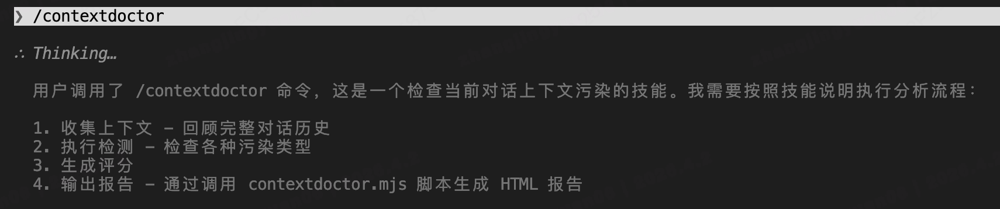
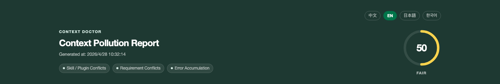
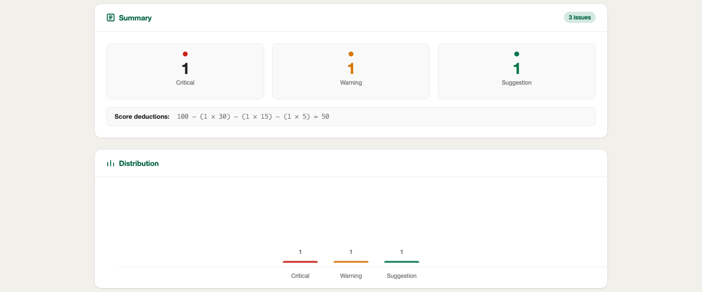
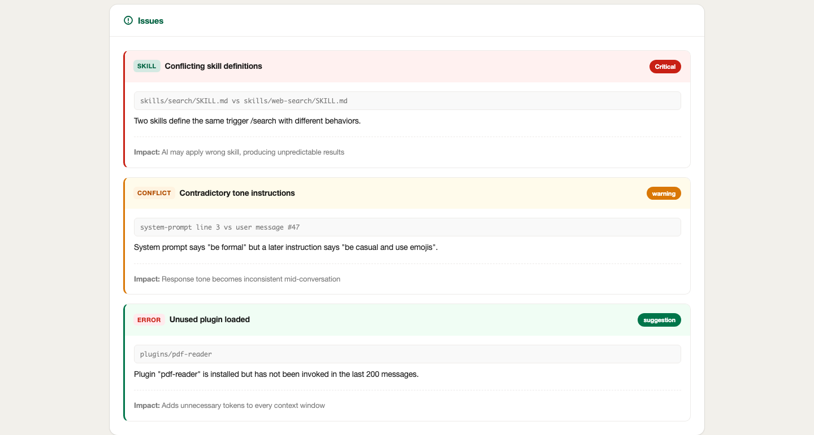
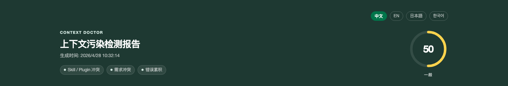

# 🩺 Context Doctor

<p align="center">
  
</p>

<p align="center">
  <b>Context Pollution Detection & Repair Tool</b>
</p>

<p align="center">
  <a href="README.md">中文</a> |
  <a href="README.en.md">English</a> |
  <a href="README.ja.md">日本語</a> |
  <a href="README.ko.md">한국어</a>
</p>

---

## 🎯 Problem Statement

When using AI Agents (Claude Code, Codex, Cursor, etc.), have you ever encountered:

1. **Conflicting Prompts** - Previous instructions conflict with current goals, confusing the AI
2. **Skill/Plugin Conflicts** - Too many loaded tools interfering with each other or overlapping
3. **Error Accumulation** - A small early error causing all subsequent reasoning to deviate

**Context Doctor** helps you detect and fix these "context pollution" issues.

---

## ✨ Features

- 🔍 **Smart Detection** - Automatically identifies 3 types of pollution: Skill conflicts, instruction contradictions, error accumulation
- 📊 **Visual Reports** - Beautiful HTML reports using the Starbucks Design System
- 🌍 **Multi-language Support** - Chinese, English, Japanese, Korean with in-report language switching
- 📅 **Timestamp Management** - Reports auto-saved to `~/.contextdoctor/reports/`, sorted by time
- 🔧 **One-click Repair** - Not only detects problems but also provides specific fixes
- 🚀 **Minimal Installation** - One command to install across all supported Agent frameworks
- 🎨 **Framework Flexibility** - Supports Claude Code, Codex CLI, Cursor, OpenCode/Crush

---

## 📦 Installation

### Option 1: Automated Installation Script

```bash
# After downloading the project, run the install script
node scripts/install.mjs
```

### Option 2: Manual Installation

#### Claude Code

```bash
# Create skill directories
mkdir -p ~/.claude/skills/contextdoctor
mkdir -p ~/.claude/skills/repair

# Copy skill files (assuming you're in the project directory)
cp plugins/contextdoctor/skills/contextdoctor/SKILL.md ~/.claude/skills/contextdoctor/
cp plugins/contextdoctor/skills/repair/SKILL.md ~/.claude/skills/repair/
```

#### Codex CLI

```bash
# Create global skill directories
mkdir -p ~/.agents/skills/contextdoctor
mkdir -p ~/.agents/skills/repair

# Copy skill files
cp plugins/contextdoctor/skills/contextdoctor/SKILL.md ~/.agents/skills/contextdoctor/
cp plugins/contextdoctor/skills/repair/SKILL.md ~/.agents/skills/repair/
```

#### Cursor

```bash
# Create commands directory
mkdir -p ~/.cursor/commands

# Copy command configuration
cp plugins/contextdoctor/.cursor-plugin/plugin.json ~/.cursor/commands/contextdoctor.json
```

#### OpenCode / Crush

```bash
# Create commands directory
mkdir -p ~/.config/opencode/commands

# Copy command file
cp plugins/contextdoctor/commands/contextdoctor.md ~/.config/opencode/commands/
```

---

## 🚀 Usage

### Check Context Pollution

```bash
/contextdoctor
```

Generates an HTML report showing:
- Comprehensive health score (0-100)
- Pollution type distribution
- Specific issue list
- Repair priority recommendations

### Get Repair Solutions

```bash
/repair
```

In addition to the detection report, provides:
- Specific repair steps for each issue
- Copy-paste ready fix text
- Recommended context cleanup strategies

---

## 📊 Report Preview

<p align="center">
  
  <br>
  <em>Run <code>/contextdoctor</code> directly in Claude Code — generates an HTML visual report in one click</em>
</p>

<p align="center">
  
  <br>
  <em>Comprehensive health score overview — grasp context status at a glance, ring color adapts to severity</em>
</p>

<p align="center">
  
  <br>
  <em>Score deduction breakdown + issue distribution chart — only shown when issues exist</em>
</p>

<p align="center">
  
  <br>
  <em>Issue detail list — tiered display with Red (Critical), Gold (Warning), Green (Suggestion); CSS indicators replace emoji</em>
</p>

<p align="center">
  
  <br>
  <em>Multi-language interface — switch between Chinese/English/Japanese/Korean with one click, preference persisted automatically</em>
</p>

Report Features:
- 🎨 **Starbucks Design System** - Warm color tones, comfortable reading experience
- 🌍 **Multi-language Interface** - Chinese/English/Japanese/Korean with one-click switching
- 📅 **Timestamp Naming** - Auto-saved to `~/.contextdoctor/reports/` for history tracking
- 📱 **Responsive Layout** - Supports desktop and mobile devices
- 🌈 **Severity Color Coding** - Red (Critical), Gold (Warning), Green (Suggestion)
- 📈 **Dynamic Charts** - Intuitive problem distribution visualization

---

## 🏗️ Supported Frameworks

| Framework | Installation | Commands |
|-----------|--------------|----------|
| Claude Code | Skill system | `/contextdoctor`, `/repair` |
| OpenAI Codex | Skills system (`.agents/skills/`) | `$contextdoctor`, `$repair` |
| Cursor | Custom Commands | `/contextdoctor`, `/repair` |
| OpenCode | `commands/` directory | `/contextdoctor`, `/repair` |
| Crush | JSON config | `contextdoctor`, `repair` |

---

## 📖 Documentation

- [COMMANDS_REFERENCE.md](docs/COMMANDS_REFERENCE.md) - Framework command implementation reference
- [DESIGN.md](docs/DESIGN.md) - Report design specifications (Starbucks Design System)
- [Begin.md](docs/Begin.md) - Project requirements document

---

## 🛠️ Development

```bash
# Clone repo
git clone https://github.com/contextdoctor/contextdoctor.git
cd contextdoctor

# Install dependencies
npm install

# Run tests
npm test

# Build plugins
npm run build
```

---

## 🤝 Contributing

Welcome contributions, issue submissions, and documentation improvements!

1. Fork this repository
2. Create feature branch (`git checkout -b feature/amazing-feature`)
3. Commit changes (`git commit -m 'Add some amazing feature'`)
4. Push branch (`git push origin feature/amazing-feature`)
5. Create Pull Request

---

## 📄 License

MIT License - see [LICENSE](LICENSE) file

---

<p align="center">
  🩺 <b>Context Doctor</b> - Guarding Your Conversation Context Health
</p>
