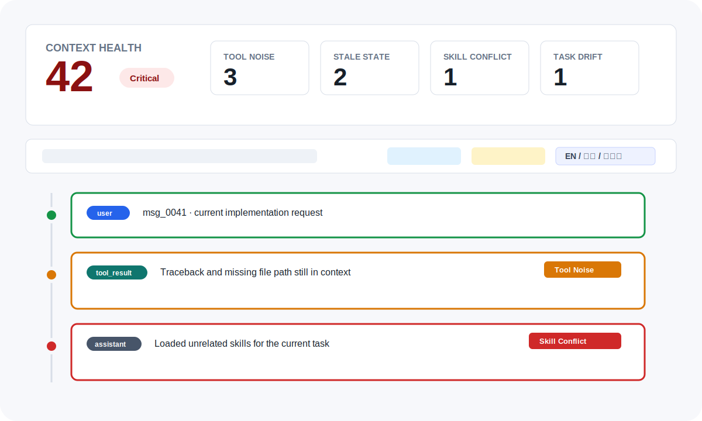

# 🩺 Context Doctor

<p align="center">
  
</p>

<p align="center">
  <b>上下文污染检测与修复工具</b>
</p>

<p align="center">
  <a href="README.md">中文</a> |
  <a href="README.en.md">English</a> |
  <a href="README.ja.md">日本語</a> |
  <a href="README.ko.md">한국어</a>
</p>

---

## 🎯 解决的问题

在使用 AI Agent（Claude Code、Codex、Cursor 等）时，你是否遇到过：

1. **提示词前后矛盾** - 之前的指令与当前目标冲突，导致 AI 困惑
2. **Skill/Plugin 冲突** - 加载了太多工具，它们互相干扰或功能重叠
3. **错误累积** - 早期的一个小错误导致后续所有推理都偏离轨道

**Context Doctor** 帮你检测并修复这些「上下文污染」问题。

---

## ✨ 特性

- 🔍 **智能检测** - 自动识别 3 大类污染：Skill 冲突、指令矛盾、错误累积
- 📊 **可视化报告** - 美观的 HTML 报告，采用 Starbucks 设计系统
- 🌍 **多语言支持** - 中文、英文、日文、韩文
- 🔧 **一键修复** - 不仅检测问题，还提供具体的修复方案
- 🚀 **极简安装** - 一条命令安装到所有支持的 Agent 框架
- 🎨 **框架灵活** - 支持 Claude Code、Codex CLI、Cursor、OpenCode/Crush

---

## 📦 安装

### 快速安装（推荐）

```bash
curl -fsSL https://contextdoctor.dev/install.sh | bash
```

### 手动安装

#### Claude Code

```bash
mkdir -p ~/.claude/skills/contextdoctor
curl -o ~/.claude/skills/contextdoctor/SKILL.md \
  https://raw.githubusercontent.com/contextdoctor/contextdoctor/main/plugins/contextdoctor/skills/contextdoctor/SKILL.md
```

#### Codex CLI

```bash
mkdir -p ~/.codex
curl -o ~/.codex/codex.md \
  https://raw.githubusercontent.com/contextdoctor/contextdoctor/main/plugins/contextdoctor/.opencode/INSTALL.md
```

#### Cursor

```bash
mkdir -p ~/.cursor/commands
curl -o ~/.cursor/commands/contextdoctor.json \
  https://raw.githubusercontent.com/contextdoctor/contextdoctor/main/plugins/contextdoctor/.cursor-plugin/contextdoctor.json
```

#### OpenCode / Crush

```bash
mkdir -p ~/.config/opencode/commands
curl -o ~/.config/opencode/commands/contextdoctor.md \
  https://raw.githubusercontent.com/contextdoctor/contextdoctor/main/plugins/contextdoctor/commands/contextdoctor.md
```

---

## 🚀 使用

### 检查上下文污染

```bash
/contextdoctor
```

生成 HTML 报告，显示：
- 综合健康评分（0-100）
- 污染类型分布
- 具体问题列表
- 修复优先级建议

### 获取修复方案

```bash
/repair
```

在检测报告基础上，额外提供：
- 每个问题的具体修复步骤
- 可直接复制使用的修复文本
- 推荐的上下文清理策略

---

## 📊 报告预览

<p align="center">
  
</p>

报告特点：
- 🎨 **Starbucks 设计系统** - 温暖的色调，舒适的阅读体验
- 📱 **响应式布局** - 支持桌面和移动设备
- 🌈 **严重等级颜色** - 红色（严重）、金色（警告）、绿色（建议）
- 📈 **动态图表** - 直观展示问题分布

---

## 🏗️ 支持的框架

| 框架 | 安装方式 | 指令 |
|------|----------|------|
| Claude Code | Skill 系统 | `/contextdoctor`, `/repair` |
| OpenAI Codex | `codex.md` + `agents/` | `/contextdoctor`, `/repair` |
| Cursor | Custom Commands | `/contextdoctor`, `/repair` |
| OpenCode | `commands/` 目录 | `/contextdoctor`, `/repair` |
| Crush | JSON 配置 | `contextdoctor`, `repair` |

---

## 📖 文档

- [COMMANDS_REFERENCE.md](docs/COMMANDS_REFERENCE.md) - 各框架指令实现参考
- [DESIGN.md](docs/DESIGN.md) - 报告设计规范（Starbucks 设计系统）
- [Begin.md](docs/Begin.md) - 项目需求文档

---

## 🛠️ 开发

```bash
# 克隆仓库
git clone https://github.com/contextdoctor/contextdoctor.git
cd contextdoctor

# 安装依赖
npm install

# 运行测试
npm test

# 构建插件
npm run build
```

---

## 🤝 贡献

欢迎贡献代码、提交 Issue 或改进文档！

1. Fork 本仓库
2. 创建特性分支 (`git checkout -b feature/amazing-feature`)
3. 提交更改 (`git commit -m 'Add some amazing feature'`)
4. 推送分支 (`git push origin feature/amazing-feature`)
5. 创建 Pull Request

---

## 📄 许可证

MIT License - 详见 [LICENSE](LICENSE) 文件

---

<p align="center">
  🩺 <b>Context Doctor</b> - 守护您的对话上下文健康
</p>
